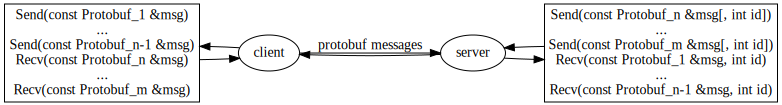

GEP: A Generic, Protobuf-Based Client-Server Protocol
=====================================================


Introduction
------------

GEP (Generic Event Protobuf aka Generic Eh... Protobuf) is a generic
protocol to implement asynchronous, protocol buffer-based,
N-clients/1-server protocols.

A protocol is defined as a series of protocol buffer
([protobuf](https://developers.google.com/protocol-buffers/?hl=en))
messages that can be exchanged between a client and a server. The
idea is to make it very easy for a user to create a new protocol by
defining:

1. the protobuf messages that the protocol will allow passing
in each direction,
2. the port where the server will listen to requests from (multiple)
clients, and
3. the tags associated to the different protobuf messages.

<div align="center">
  
  <br>
  Figure 1: Diagram of a GEP protocol-based client/server.
  <br>
</div>

GEP-based protocols are asynchronous by definition: The sender sends
a protobuf message to the receiver, and it does not wait for an answer
from the receiver. If your protocol needs status/return messages,
they need be implemented on top of GEP.

The asynchronous behavior is coherent with the operation of the main user,
where one server sends and receives messages to/from multiple clients.
The use of protobuf messages allows both clients and servers that keep
their data structures as protobufs themselves. This makes the code
extremely simple, and very easy to serialize (e.g. dump state in the
logs in a systematic way).


GEP Manual
----------

The best way to learn how to use GEP is by checking the provided example,
called SGP. Check the [SGP Documentation](example). Note that
all the `example/sgp_*` files are mostly boilerplate, so it should be
easy to adapt them for your own protocol.

Note that both the client and server stub classes, when started, will
create a thread in charge of receiving messages and running the callback
functions.

In order to test the current code, you need a modern version of protobuf
(This will change once proto3 is officially released).

The following code installs it in a private, temporary directory.

```bash
git clone https://github.com/google/protobuf
cd protobuf/
./autogen.sh
PROTOBUF_PREFIX=/tmp/usr
./configure --prefix=$PROTOBUF_PREFIX
make
make install
cd ..
```

Once you have installed it, try the libgep code:

```bash
git clone https://github.com/google/libgep
cd libgep/
PROTOBUF_PREFIX=/tmp/usr make
PROTOBUF_PREFIX=/tmp/usr make test
```

`make` will create 4 libraries, namely `libgepclient.a`,
`libgepclient-lite.a`, `libgepserver.a`, and
`libgepserver-lite.a`. You also need the .h headers in
the `include/` directory.


GEP Operation: Protocol Definition
----------------------------------

As mentioned before, a GEP-based protocol is defined by 2 sets of
protobuf messages (those that clients can send to the server, and
those that the server can send to the clients), a port number,
and the per-protobuf message tags.

In the future most of this information can be provided by the user
using something like a
[grpc](http://www.grpc.io/) service, but currently the user needs
to define this information in her own C++ class.

The first part is to define the set of messages that clients and
server can exchange to each other:


    $ cat examples/sgp.proto
    ...
    message Command1 {
      optional int64 a = 1;
      optional int32 b = 2;
    }

    message Command2 {
      optional int64 id = 1;
    }
    ...

    Figure 2: SGP (a GEP-based protocol) messages.


Then, the user must define the protocol as a class (called SGPProtocol
in this case) that derives from GepProtocol, and which implements a
couple of functions that map a set of unique IDs (aka ``tags'') to
the protobuf messages that can be passed back and forth between client
and server.
In particular, GetTag() maps a protobuf message to a tag, while
GetMessage() maps a tag to a protobuf message.

    $ cat example/sgp_protocol.h
    ...
    class SGPProtocol : public GepProtocol {
     ...
      // supported messages
      static constexpr uint32_t MSG_TAG_COMMAND_1 =
          MakeTag('c', 'm', 'd', '1');
      static constexpr uint32_t MSG_TAG_COMMAND_2 =
          MakeTag('c', 'm', 'd', '2');
      ...
      // returns the tag associated to a message.
      virtual uint32_t GetTag(const GepProtobufMessage *msg);
      // constructs an object of a given type.
      virtual GepProtobufMessage *GetMessage(uint32_t tag);
    };
    ...

    $ cat example/sgp_protocol.cc
    uint32_t SGPProtocol::GetTag(const GepProtobufMessage *msg) {
      if (dynamic_cast<const Command1Message *>(msg) != NULL)
        return MSG_TAG_COMMAND_1;
      else if (dynamic_cast<const Command2Message *>(msg) != NULL)
        return MSG_TAG_COMMAND_2;
      ...
    }

    GepProtobufMessage *SGPProtocol::GetMessage(uint32_t tag) {
      GepProtobufMessage *msg = NULL;
      switch (tag) {
        case MSG_TAG_COMMAND_1:
          msg = new Command1Message();
          break;
        case MSG_TAG_COMMAND_2:
          msg = new Command2Message();
          break;
        ...
      }
      return msg;
    }

    Figure 3: Implementation of SGPProtocol.


GEP Operation: Client/Server Definition
---------------------------------------

After defining the protocol, the user must define the client and server
classes (both are very similar). The client must derive from GepClient,
and the server from GepServer (these classes implement the network
operations). Both must include the receiver callbacks that will be
called when a message is received.

Both client and server must be initialized with a virtual function table
(GepVFT) that maps each tag a side wants to listen to, to the callback
that must be called on receiving one.


    $ cat example/sgp_client.h
    ...
    class SGPClient: public GepClient {
     public:
      SGPClient();
      ...

      // protocol object callbacks: These are object (non-static) callback
      // methods, which is handy for the callers.
      virtual bool Recv(const Command1 &msg) = 0;
      virtual bool Recv(const Command2 &msg) = 0;
      ...
    };

    const GepVFT kSGPClientOps = {
      {SGPProtocol::MSG_TAG_COMMAND_1, &RecvMessage<SGPClient, Command1>},
      {SGPProtocol::MSG_TAG_COMMAND_2, &RecvMessage<SGPClient, Command2>},
      ...
    };

    Figure 4: Implementation of SGPClient.


The SGPServer implementation is very similar to that of SGPClient. The
main difference is that the Recv() callbacks can have an extra parameter
(``id''), identifying the client that sent the message.


    $ cat example/sgp_server.h
    ...
    class SGPServer: public GepServer {
     public:
      SGPServer();
      ...

      // protocol object callbacks: These are object (non-static) callback
      // methods, which is handy for the callers.
      virtual bool Recv(const Command1 &msg, int id) = 0;
      virtual bool Recv(const Command2 &msg, int id) = 0;
      ...
    };

    const GepVFT kSGPServerOps = {
      {SGPProtocol::MSG_TAG_COMMAND_1, &RecvMessageId<SGPServer, Command1>},
      {SGPProtocol::MSG_TAG_COMMAND_2, &RecvMessageId<SGPServer, Command2>},
      ...
    };

    Figure 5: Implementation of SGPServer.


Both client and server can use `Send(const Message& msg)` to send a
message to the other side.


GEP Implementation Details
--------------------------

In the client side, a GepChannel object provides a SendMessage()
function that allows sending protobuf messages to the server. It also
provides a (selectable) socket where to listen for messages from the
server, and a RecvData() function that creates a protobuf message
and dispatches it to the corresponding callback.

The GepClient object performs the obvious client reception side:
select socket, receive message, dispatch it.

In the server side, a GepChannelArray object provides a SendMessage()
function that allows sending protobuf messages to all the clients,
plus a per-client SendMessage() that sends the message to a single
one. It also provides a (selectable) server socket where to listen
for connections from the server, and a (bound size) vector of
GepChannel objects that give access to the (selectable) sockets where
to listen for messages from the different clients (and their
RecvData() function).

The GepServer object performs the obvious server reception side (select
server and per-client sockets, create an object for new clients,
receive message and dispatch it for messages).


GEP Protocol
------------

Any GEP-derived protocol encodes a protobuf message in the wire using
a very simple wire format:

        0                   1                   2                   3
        0 1 2 3 4 5 6 7 8 9 0 1 2 3 4 5 6 7 8 9 0 1 2 3 4 5 6 7 8 9 0 1
       +-+-+-+-+-+-+-+-+-+-+-+-+-+-+-+-+-+-+-+-+-+-+-+-+-+-+-+-+-+-+-+-+
     0 |                            gep_id                             |
       +-+-+-+-+-+-+-+-+-+-+-+-+-+-+-+-+-+-+-+-+-+-+-+-+-+-+-+-+-+-+-+-+
     4 |                              tag                              |
       +-+-+-+-+-+-+-+-+-+-+-+-+-+-+-+-+-+-+-+-+-+-+-+-+-+-+-+-+-+-+-+-+
     8 |                           value_len                           |
       +-+-+-+-+-+-+-+-+-+-+-+-+-+-+-+-+-+-+-+-+-+-+-+-+-+-+-+-+-+-+-+-+
    12 |                              ...                              |
       |                            message                            |
       |                              ...                              |
       +-+-+-+-+-+-+-+-+-+-+-+-+-+-+-+-+-+-+-+-+-+-+-+-+-+-+-+-+-+-+-+-+

    Figure 6: A GEP protocol packet in the wire.

Where:

  - gep\_id: unique GEP identificator [4 bytes]. Default is `gepp`
    (0x67657070).
  - tag: tag identifying the message being sent [4 bytes]. The tags are
    those used to defined the protocol.
  - value\_len: length of the message [4 bytes]. This is the length of the
    packet (minus the 12-byte header).
  - message: a serialized protobuf message [value\_len bytes]. Default
    is to use a text protobuf, which allows easy debugging by reading
    the packets in the wire. Binary protobufs can be selected too (and
    are the default in the lite mode).


Protobuf-Lite Support
---------------------

GEP also provides a protobuf-lite version. Protobuf-lite is a light
version of protobuf (the libraries are 1/10th the size of vanilla
protobuf) in exchange of support for neither descriptors nor reflection.
There is no support for text protobufs in lite mode, so the protocol
will use binary ones in the wire.

In order to use the lite version of GEP, you need to:

1. ensure you define the GEP lite flag before you include any of the
   GEP header files (`GEP_LITE`).
2. link with the lite version of the libraries (`libgepclient-lite.a` and
   `libgepserver-lite.a`)


Future Work
-----------

As mentioned before, currently GEP-based protocols need to adapt some
amount of boilerplate (see the `example/` directory) for each new protocol.
Typically, the user needs to copy the protocol, client, and server stubs
from an example, and fill them with her data.

In the future most of this information can be provided by the user
using something like a
[grpc](http://www.grpc.io/) service.


